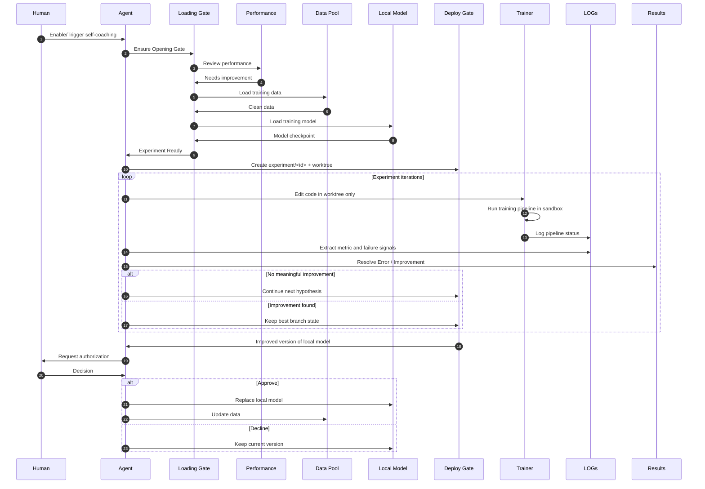

# self-coaching

**Author:** [Miya-Liu](https://github.com/Miya-Liu)

A **Cursor skill** that **coaches an agent** to improve a **model** inside a **git** repository: isolated **worktree** experiments, file-based training logs, **Experience** (persistent experiment/error/learnings), and **user-authorized merge** to upstream.

After you clone from GitHub, copy this repository into `.cursor/skills/self-coaching/` (project) or `~/.cursor/skills/self-coaching/` (personal).

The default **target git tree** in this pack is the vendored trainer: `upstream/autoresearch/` (from [karpathy/autoresearch](https://github.com/karpathy/autoresearch)). The same workflow applies to other ML repos you attach.

## Workflow

**How this maps in the default pack**

| Concept | Typical implementation |
|---------|-------------------------|
| **Loading Gate** | Dependencies, `prepare.py`, cache readiness, configured checkpoint paths (see `SKILL.md`). |
| **Performance** | Primary metric from `logs/<id>.log` (e.g. `val_bpb`) vs best; guardrails. |
| **Data Pool** | Training/val data (e.g. under `~/.cache/autoresearch/`) plus anything you curate—**including** dialogue the agent collected with users or **self-play** artifacts you point the pipeline at. |
| **Local Model** | Admin-chosen baseline: which checkpoint / which size variant (full vs smaller) before the run; see `SKILL.md` **Local Model configuration**. |
| **Deploy Gate** | Isolation (`experiment/<id>` + `worktrees/…`) and **human approval** before replacing the integrated line or promoted weights. |
| **LOGs** | `logs/<id>.log` (full train output; never flood the chat). |
| **Results** | Recorded outcomes in `experience/` (experiment log, errors, learnings). |

The experiment loop runs autonomously inside the **Deploy Gate** boundary; **Replace local model** / **Update data** after approval are the only steps that change the canonical line the way your org defines it (merge, checkpoint swap, dataset refresh).

**Data Pool** includes data the agent gathered in prior user interactions and/or data produced in **self-play**, as long as your `prepare` / dataloader paths are wired to those sources.

**Local Model** is configured by admins (which checkpoint, main vs smaller model, device, etc.); the skill treats that configuration as fixed for a run unless policy says otherwise.

## What this skill is for

- **Coach the agent** on *how* to run training, when to stop, and how to record outcomes—without flooding context with full `train` logs.
- **Focus the model**: architecture, `train.py` (or equivalent), metrics like `val_bpb`—i.e. the model the agent is training in that repo.
- **Experience** = durable logs under `experience/` (`EXPERIMENT_LOG.md`, `ERROR.md`, `LEARNINGS.md`).

## Layout

- `SKILL.md` — full procedure (git, worktree, training redirect, merge gate, **Experience**)
- `docs/RUNBOOK.md` — quick setup
- `docs/ARCHITECTURE.md` — structure
- `upstream/autoresearch/` — vendored repo to train
- `experience/` — **Experience** templates and optional `RUN_SUMMARY.json`
- `scripts/` — `preflight.sh`, `run-once.sh`, `init-experience.sh`, hook helpers, `activator.sh`
- `logs/` / `worktrees/` — created at runtime (see `.gitignore`)
- `references/hooks-setup.md` — hook wiring

## Quick start

1. Copy this folder to e.g. `~/.cursor/skills/self-coaching/` or `.cursor/skills/self-coaching/`.
2. Run `bash scripts/init-experience.sh`.
3. Read `docs/RUNBOOK.md` then `SKILL.md`.
4. Add hooks from `references/hooks-setup.md` if you want.

## Scope

- Training runs are automated within guardrails; **merge to upstream `main`** and **external promotion** require explicit user approval.
