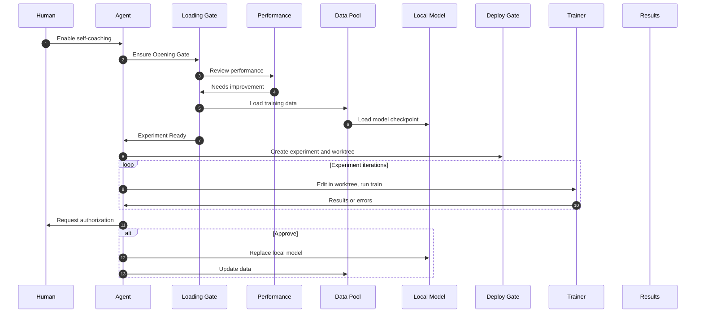

# self-coaching

Portable, agent-agnostic evolution platform: a **skill pack** (`modes/self-coaching/`) plus an optional **mock runtime** for end-to-end validation. The contract is **`modes/self-coaching/SKILL.md`** and on-disk **Experience** — not tied to one IDE.

| Mode | Who evolves | Deploy |
|------|-------------|--------|
| **self-coaching** | Host agent | **T1** skill pack |
| **coach** | Coach service supervises external agents | **T2** API + **T3** engine |

Submodules: **self-learning**, **self-questioning**, **self-evaluation**, **self-tuning**. Full docs: [`docs/README.md`](docs/README.md).

## Quick install

```bash
git clone https://github.com/Miya-Liu/self-coaching.git && cd self-coaching
bash scripts/install-skill-pack.sh --hermes              # Hermes skills + mock harness
bash scripts/install-skill-pack.sh --hermes --with-mock  # + pip install -e . for python -m self_coaching.demo
```

Repo clone (no Hermes): `bash scripts/install-skill-pack.sh . --with-mock`

**Windows:** Git Bash or WSL for install scripts; mock demo from PowerShell: `python scripts/mock_self_coaching_demo.py`

Upgrade Hermes skills after `git pull`: `bash scripts/update-skill-pack.sh --hermes`. Details: [`docs/guides/deploy-skill-pack.md`](docs/guides/deploy-skill-pack.md).

## Workflow



Gate → implementation mapping: [architecture.md](docs/design/architecture.md#conceptual-mapping). Experiment iterations run inside the **Deploy Gate**; merge to `main` or weight swap requires **human approval**.

## Try the mock loop

```bash
bash scripts/mock-self-coaching-demo.sh          # Linux / Git Bash
python scripts/mock_self_coaching_demo.py        # Windows / cross-platform
```

Expected: `completeness: PASS` (C01–C18 audit). More: [runbook](docs/guides/runbook.md#mock-loop-demo).

## Backend router testing

The loop routes each capability through **`ORCHESTRATOR_*_BACKEND`** env flags. `build_loop_client()` in `modes/self-coaching/loop_env.py` assembles a **`CompositeClient`** that delegates to mock adapters or real services.

| Capability | Env flag | Values | Isolated smoke script |
|------------|----------|--------|------------------------|
| Eval / holdout | `ORCHESTRATOR_EVAL_BACKEND` | `mock`, `agentevals` | `scripts/agentevals_live_smoke.py` |
| Learn (E-path) | `ORCHESTRATOR_LEARN_BACKEND` | `mock`, `self-learning` | `scripts/mock-self-learning-smoke.sh` |
| Self-questioning (C06/C07) | `ORCHESTRATOR_SELF_QUESTIONING_BACKEND` | `mock`, `pipeline` | `scripts/pipeline_self_questioning_smoke.py` |
| Train (T-path) | `ORCHESTRATOR_TRAIN_BACKEND` | `mock`, `aerl`, `cli` | `scripts/cli_train_smoke.py` |

Legacy alias: `ORCHESTRATOR_SELFPLAY_BACKEND` → `ORCHESTRATOR_SELF_QUESTIONING_BACKEND` (still accepted in `.env` files).

Set `LOOP_SERVICE_MODE=live` and copy the matching profile from `scenarios/*.env.example` → `scenarios/*.env` (gitignored; do not commit secrets). Full runbook: [`docs/guides/runbook.md`](docs/guides/runbook.md#live-integration-validation-track-1).

### Team environment setup (real `.env` files)

Committed `scenarios/*.env.example` files hold **non-secret** defaults (service URLs, suite IDs, timeouts). Each teammate copies locally:

```bash
cp scenarios/demo.live.env.example scenarios/demo.live.env
# or per-backend profiles:
cp scenarios/demo.agentevals.env.example scenarios/demo.env
cp scenarios/demo.pipeline.env.example scenarios/demo.pipeline.env
cp scenarios/demo.cli-train.env.example scenarios/demo.cli-train.env
```

Then fill **secret** placeholders (`<your-service-role-key>`, `<your-bridge-user-id>`, API keys) from your team secret store — never commit the filled `.env` files. Share secrets out-of-band (1Password, Vault, encrypted channel); keep only `*.env.example` in git.

Verify connectivity before a long run:

```bash
python scripts/agentevals_live_smoke.py
python scripts/evolution_loop_clock_smoke.py --env-file scenarios/demo.live.env --phase preflight
```

Mock-only work needs no `.env` copy: `python scripts/clock_loop_smoke.py` and `pytest -q` use in-process mocks by default.

### Layer 0 — all mock (CI baseline)

Verifies the evolution engine + clock wiring with every backend on mock (~seconds):

```bash
python scripts/clock_loop_smoke.py
pytest -q
```

### Layer 1 — one real backend at a time

Test each adapter before combining them.

**AgentEvals** — copy `scenarios/demo.agentevals.env.example` → `scenarios/demo.env`:

```bash
python scripts/agentevals_live_smoke.py
# or with env file loaded:
python scripts/mock_self_coaching_demo.py --env-file scenarios/demo.env
```

**Pipeline self-questioning (C06/C07)** — copy `scenarios/demo.pipeline.env.example` → `scenarios/demo.pipeline.env`:

```bash
# Safe connectivity (no real GPU/LLM work):
PIPELINE_DRY_RUN=1 python scripts/pipeline_self_questioning_smoke.py
# with env file:
set PIPELINE_SERVICE_URL=http://10.110.158.146:8001   # PowerShell; use export on bash
python scripts/pipeline_self_questioning_smoke.py
```

**CLI train (db_bridge → AReaL host)** — copy `scenarios/demo.cli-train.env.example` → `scenarios/demo.cli-train.env` and fill Supabase credentials:

```bash
python scripts/cli_train_smoke.py --env-file scenarios/demo.cli-train.env --probe
python scripts/remote_shell.py --env-file scenarios/demo.cli-train.env -- echo hello
```

Requires `run_shell_runner` active on the AReaL GPU host.

### Layer 2 — full live integration (Track 1)

All three real backends + mock learn. Copy `scenarios/demo.live.env.example` → `scenarios/demo.live.env`.

Run in order (do not skip CLI probe before a full tick when `ORCHESTRATOR_TRAIN_BACKEND=cli`):

```bash
# 1. Health checks (~30s)
python scripts/evolution_loop_clock_smoke.py --env-file scenarios/demo.live.env --phase preflight

# 2. db_bridge round-trip (~2 min)
python scripts/evolution_loop_clock_smoke.py --env-file scenarios/demo.live.env --phase preflight --probe-cli

# 3. Integrated tick, mock train + pipeline dry_run (~1–5 min) — optional
python scripts/evolution_loop_clock_smoke.py --env-file scenarios/demo.live.env --dry-run

# 4. Full live tick (30–90+ min): C06 pipeline → C07 pipeline → CLI train → AgentEvals holdout
python scripts/evolution_loop_clock_smoke.py --env-file scenarios/demo.live.env

# 5. On PASS only — update regression golden
python scripts/evolution_loop_clock_smoke.py --env-file scenarios/demo.live.env --write-golden
```

**Success:** exit code 0; audit rows **C06, C07, C12, C18** pass. `promoted=false` is OK when the holdout gate rejects the candidate.

**Progress logs:** step output is on by default (`[clock]`, `[pipeline]`, `[cli-train]`, `[agentevals]`). Disable with `LOOP_STEP_LOG=0`.

**Faster smoke:** `scenarios/evolution_loop_live.json` uses a fast fixture profile (`sigma_min=1`, `sigma_play=1`, `beta=1`) so C06/C07 request `n=1`. CLI train duration is unchanged.

**Artifacts** after a tick: `mock-services/ci-evolution-loop/.self-coaching/loop/` (`e_path_last.json`, `t_path_last.json`, `completeness_report.json`).

**Opt-in pytest:**

```bash
EVOLUTION_LOOP_INTEGRATION_TESTS=1 EVOLUTION_LOOP_ENV_FILE=scenarios/demo.live.env \
  pytest tests/integration/test_evolution_loop_live.py -k preflight -v
```

## Repo layout (essentials)

| Path | Role |
|------|------|
| `modes/self-coaching/` | T1 skill pack (5 skills) |
| `modes/coach/` | Coach mode shell |
| `mock-services/` | Mock Coaching API (T2) |
| `services/orchestrator/` | Evolution engine (T3) |
| `scripts/` | Install, doctor, demos |
| `docs/` | [Documentation index](docs/README.md) |

Default trainer path: AERL HTTP pipelines (`scripts/run-pipeline.sh`) or mock loop (`python -m self_coaching.demo`).

## Scope

Training may run autonomously inside a worktree; **merge** and **production promotion** always need explicit user approval.
