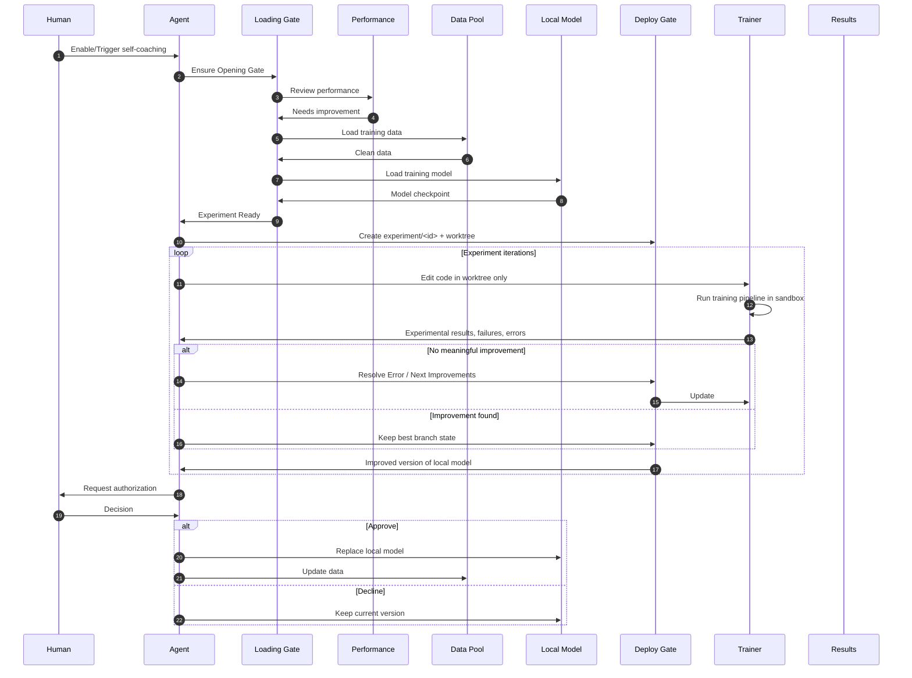

# self-coaching

An **agent skill** (any LLM or coding **agent** that can follow `SKILL.md` and run Bash): it **coaches** that agent to improve a **model** inside a **git** repository—isolated **worktree** experiments, file-based training logs, **Experience** (persistent experiment/error/learnings), and **user-authorized merge** to upstream. This is **not** tied to a single product; the contract is the repo layout + `SKILL.md`.

**Install** the folder wherever your environment expects skills: project-local `skills/self-coaching`, a shared `tools/` tree, or a path your stack documents (see [Installation paths](#installation-paths)). Wire your **agent** to load `SKILL.md` the way you load other long-running instructions (e.g. rules file, `AGENTS.md` pointer, or a vendor “skill�import).

The default **target git tree** in this pack is the vendored trainer: `upstream/autoresearch/` (from [karpathy/autoresearch](https://github.com/karpathy/autoresearch)). The same workflow applies to other ML repos you attach.

## Workflow



**How this maps in the default pack**

| Concept | Typical implementation |
|---------|-------------------------|
| **Loading Gate** | Dependencies, `prepare.py`, cache readiness, configured checkpoint paths (see `SKILL.md`). |
| **Performance** | Primary metric from `logs/<id>.log` (e.g. `val_bpb`) vs best; guardrails. |
| **Data Pool** | Training/val data (e.g. under `~/.cache/autoresearch/`) plus anything you curate�*including** dialogue the agent collected with users or **self-play** artifacts you point the pipeline at. |
| **Local Model** | Admin-chosen baseline: which checkpoint / which size variant (full vs smaller) before the run; see `SKILL.md` **Local Model configuration**. |
| **Deploy Gate** | Isolation (`experiment/<id>` + `worktrees/…`) and **human approval** before replacing the integrated line or promoted weights. |
| **Trainer feedback** | Trainer returns experimental outcomes, failures, and errors to the agent; full raw run output still lands in `logs/<id>.log`. |
| **Results** | Agent-resolved outcomes written to `experience/` (experiment log, errors, learnings). |

The experiment loop runs autonomously inside the **Deploy Gate** boundary; **Replace local model** / **Update data** after approval are the only steps that change the canonical line the way your org defines it (merge, checkpoint swap, dataset refresh).

**Data Pool** includes data the agent gathered in prior user interactions and/or data produced in **self-play**, as long as your `prepare` / dataloader paths are wired to those sources.

**Local Model** is configured by admins (which checkpoint, main vs smaller model, device, etc.); the skill treats that configuration as fixed for a run unless policy says otherwise.

## What this skill is for

- **Coach the agent** on *how* to run training, when to stop, and how to record outcomes—without flooding context with full `train` logs.
- **Focus the model**: architecture, `train.py` (or equivalent), metrics like `val_bpb`—i.e. the model the agent is training in that repo.
- **Experience** = durable logs under `experience/` (`EXPERIMENT_LOG.md`, `ERROR.md`, `LEARNINGS.md`).

## Layout

- `SKILL.md` �full procedure (git, worktree, training redirect, merge gate, **Experience**)
- `docs/RUNBOOK.md` �quick setup
- `docs/ARCHITECTURE.md` �structure
- `upstream/autoresearch/` �vendored repo to train
- `experience/` �**Experience** templates and optional `RUN_SUMMARY.json`
- `scripts/` �`preflight.sh`, `run-once.sh`, `init-experience.sh`, hook helpers, `activator.sh`
- `logs/` / `worktrees/` �created at runtime (see `.gitignore`)
- `references/hooks-setup.md` �hook wiring (optional; map events to your host)

## Installation paths

Use **one** of these (or your own); only the path in hook commands and docs needs to be consistent.

| Where | Example |
|--------|---------|
| Project-local | `my-repo/skills/self-coaching/` |
| User global | `~/skills/self-coaching/` or `~/.config/self-coaching/skill/` |
| Cursor (if you use it) | `~/.cursor/skills/self-coaching/` or `.cursor/skills/self-coaching/` |
| Other IDEs / agents | Follow that product’s “skills�or “rules�directory; set hook `command` to **absolute** paths if relative paths are unreliable. |

Hooks in `references/hooks-setup.md` are **illustrative** (JSON + shell); adapt event names to your product.

## Quick start

1. Get the skill tree: copy this folder, **or** clone from GitHub (see [GitHub: clone, push, and SSH](#github-clone-push-and-ssh)).
2. Place it on disk where your **agent** is configured to read it (project-local `skills/self-coaching`, a global skills dir, or your vendor’s default—see [Installation paths](#installation-paths)).
3. Run `bash scripts/init-experience.sh`.
4. Read `docs/RUNBOOK.md` then `SKILL.md`.
5. Add hooks from `references/hooks-setup.md` if you want.

## GitHub: clone, push, and SSH

Use an **SSH remote** so Git authenticates with your **SSH key and `~/.ssh/config`**, not HTTPS username/password or a token in the URL.

**Clone** (replace the repo name if yours differs):

```bash
git clone git@github.com:Miya-Liu/self-coaching.git
```

**Add or switch `origin` to SSH** (if you already have a local copy or used HTTPS before):

```bash
git remote add origin git@github.com:Miya-Liu/self-coaching.git
# or, to switch an existing origin from HTTPS to SSH:
# git remote set-url origin git@github.com:Miya-Liu/self-coaching.git
git push -u origin main
```

**Auth** is determined by your OpenSSH client, typically:

- **Linux / macOS / Git Bash:** `~/.ssh/config`
- **Windows:** `C:\Users\<YourUser>\.ssh\config` (same file name; OpenSSH on Windows uses it the same way)

Point your `Host github.com` entry at the right key, for example:

```ssh-config
Host github.com
  HostName github.com
  User git
  IdentityFile ~/.ssh/id_ed25519
  IdentitiesOnly yes
```

Adjust `IdentityFile` to match the private key you [added to GitHub](https://github.com/settings/keys). If you use a **custom Host alias** (e.g. `Host github.com-work` with its own key), clone and set `origin` using that alias host in the SSH URL shape Git expects (often you still use `git@github.com:...` if `HostName github.com`; for multi-account setups follow your existing `ssh` config patterns).

Verify:

```bash
ssh -T git@github.com
```

You should see a GitHub greeting for your account before pushing.

## Scope

- Training runs are automated within guardrails; **merge to upstream `main`** and **external promotion** require explicit user approval.
