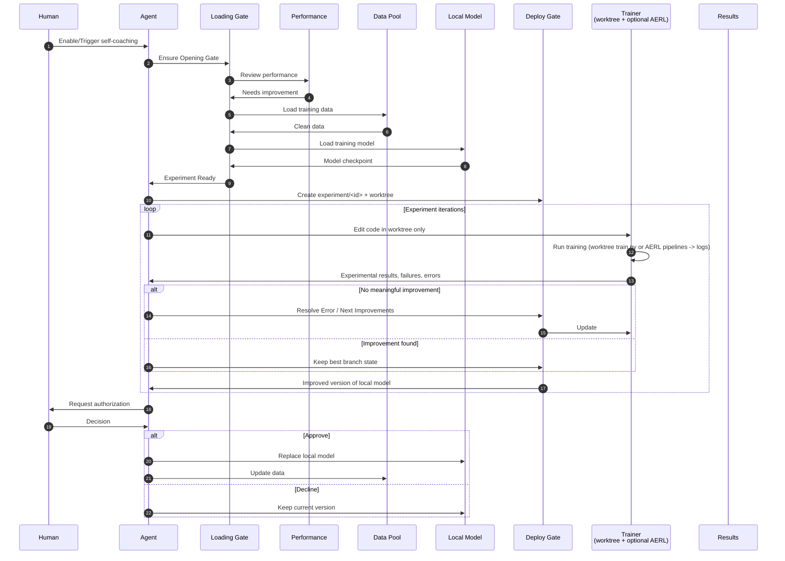

# self-coaching

> **Skill pack + mock runtime.** This repo ships five Hermes-discoverable skills under `modes/self-coaching/` (see [`SKILLS.md`](SKILLS.md)). The repo root also contains the mock demo runtime (`mock-services/`, `services/`, `tools/`, `tests/`, …). To install **only** the skill bits into Hermes, run `bash scripts/install-skill-pack.sh --hermes`.

## Install (Hermes Agent users)

```bash
git clone https://github.com/Miya-Liu/self-coaching.git
cd self-coaching
bash scripts/install-skill-pack.sh --hermes        # minimal: 5 skills only
bash scripts/install-skill-pack.sh --hermes --with-mock   # + runnable mock demo
```

After the initial install, pull the repo and refresh skills when we ship updates (**Hermes only**):

```bash
git pull
bash scripts/update-skill-pack.sh --hermes --dry-run   # preview diffs
bash scripts/update-skill-pack.sh --hermes             # apply upstream changes
bash scripts/update-skill-pack.sh --hermes --force     # overwrite local skill edits
```

**Other agents** (repo clone, Cursor, pack copy): `git pull`, compare `modes/self-coaching/SKILL_PACK_VERSION`, re-copy or re-run `bash scripts/install-skill-pack.sh <root>` — see [`deploy-skill-pack.md`](docs/guides/deploy-skill-pack.md#upgrade).

`pyproject.toml` is for the **Python mock runtime only** — it does not install skills into Hermes. Use the table below to pick the right path:

| You want to… | Run |
| --- | --- |
| Just use the skills in Hermes | `bash scripts/install-skill-pack.sh --hermes` |
| Also run the mock demo locally | `bash scripts/install-skill-pack.sh --hermes --with-mock` |
| Update Hermes skills after `git pull` | `bash scripts/update-skill-pack.sh --hermes` |
| Update repo clone / Cursor / pack copy | `git pull` + compare `SKILL_PACK_VERSION` + re-copy or `install-skill-pack.sh <root>` |
| Develop / modify the runtime | `pip install -e .` (from a repo clone; skills still need `--hermes` if you use Hermes) |

**Windows:** use **Git Bash** or **WSL** — `install-skill-pack.sh` is POSIX bash only (no `install-skill-pack.ps1`). The script resolves paths via `$HOME` (e.g. `C:\Users\you\.hermes\skills`). For the mock demo from PowerShell after install, use `.\scripts\mock-self-coaching-demo.ps1`.

See also [`docs/guides/install-as-hermes-skill.md`](docs/guides/install-as-hermes-skill.md).

A **portable, agent-agnostic evolution platform** for coaching any LLM or coding **agent** that can follow markdown skills and run Bash. The contract is **`modes/self-coaching/SKILL.md`** (orchestration policy) plus on-disk **Experience** — not tied to a single IDE or product.

**Purpose:** a gated loop from **observation** through **self-learning** (memory/skills), **self-play** data, **self-evaluation**, optional **self-tuning** (AERL SFT/GRPO), and **user-authorized** merge or promotion. The same submodules and evolution engine serve two **modes**:

| Mode | Who evolves | Typical deploy |
|------|-------------|----------------|
| **self-coaching** | The **host agent** evolves itself | **T1** — `modes/self-coaching/` |
| **coach** | A **coach service** supervises **external agents** | **T2** Coaching API + **T3** evolution engine |

**Submodules** (under `modes/self-coaching/`): **self-learning**, **self-play**, **self-evaluation**, **self-tuning**. Naming reference: [`docs/design/README.md`](docs/design/README.md#canonical-naming). Architecture: [`docs/design/architecture.md`](docs/design/architecture.md).

Load **`modes/self-coaching/SKILL.md`** for the full loop, or one submodule when executing a single phase. See **`modes/self-coaching/DESCRIPTION.md`**. Repo-root **`scripts/`** (`mock-run-all.sh`, `run-pipeline.sh`, …) and **`mock-services/`** (CLI, HTTP, contract JSON) support deterministic dry runs.

**self-coaching** mode: install or clone; point the agent at `modes/self-coaching/SKILL.md`. **coach** mode: schedule eval and improvement for external agents — [`docs/guides/deploy-overview.md`](docs/guides/deploy-overview.md#coach-mode), `modes/coach/`.

The default **target git tree** for the autoresearch-style trainer loop is an **external clone** of [karpathy/autoresearch](https://github.com/karpathy/autoresearch) (set `AUTORESEARCH_ROOT`; see [`upstream/README.md`](upstream/README.md)).


## Workflow



**How this maps in the default pack**

| Concept | Typical implementation |
|---------|-------------------------|
| **Loading Gate** | Dependencies, `prepare.py`, cache readiness, configured checkpoint paths (see `modes/self-coaching/SKILL.md`). |
| **Performance** | Primary metric from `logs/<id>.log` (e.g. `val_bpb`) vs best; guardrails. |
| **Data Pool** | Training/val data (e.g. under `~/.cache/autoresearch/`) plus curated or **self-play** artifacts. |
| **Local Model** | Admin-chosen baseline checkpoint before the run (`modes/self-coaching/SKILL.md` **Local Model configuration**). |
| **Deploy Gate** | Isolation (`experiment/<id>` + `worktrees/...`) and **human approval** before merge or weight swap. |
| **Trainer** | `uv run train.py` in worktree (`scripts/run-once.sh`); or **AERL** via `modes/self-coaching/self-tuning/pipelines/` + `scripts/run-pipeline.sh`. |
| **Trainer feedback** | Outcomes to the agent; full stdout/stderr in `logs/<id>.log` only. |
| **Results** | `experience/` summaries; durable artifacts per `modes/self-coaching/SKILL.md` (memory, skills, eval cases, curated data). |

The experiment loop runs autonomously inside the **Deploy Gate**; **Replace local model** / **Update data** after approval are the only steps that change the canonical integration line.

**Data Pool** includes prior user interactions and/or **self-play** output, as long as dataloader paths are wired.

**Local Model** is admin-configured for a run unless policy says otherwise.

## What this repo is for

- **Orchestrate** how an agent learns from tasks, generates stress data, evaluates, trains, and records outcomes — without flooding context with full `train` logs.
- **Focus the model** when self-tuning: architecture, `train.py`, metrics like `val_bpb`.
- **Experience** = durable logs under `experience/` (`EXPERIMENT_LOG.md`, `ERROR.md`, `LEARNINGS.md`).
- **Submodules** under `modes/self-coaching/` for phase-specific execution (see `modes/self-coaching/DESCRIPTION.md`).
- **Coach mode** (optional): same evolution engine supervises external agents via AgentEvals, agent API, scheduled `record-eval` / `check-drop` / `run`.

## Layout

| Path | Role |
|------|------|
| **`modes/self-coaching/`** | **self-coaching** mode — T1 self-coaching pack |
| `modes/self-coaching/SKILL.md` | Umbrella orchestration (`name: self-coaching`) |
| `modes/self-coaching/self-learning/` | Submodule: memory, skills, eval cases |
| `modes/self-coaching/self-play/` | Submodule: tasks and trajectories |
| `modes/self-coaching/self-evaluation/` | Submodule: eval runners and gates |
| `modes/self-coaching/self-tuning/` | Submodule: SFT/GRPO pipelines + `services/example.env` |
| `modes/self-coaching/adapters/` | Install into external agent hosts |
| **`modes/coach/`** | **coach** mode shell (planned: registry, scheduler, proxy) |
| **`configs/`** | Example YAML (`self-coaching.example.yaml`, `coach.example.yaml`) |
| **`services/orchestrator/`** | Evolution engine (T3) |
| `services/adapters/` | AgentEvals, production agent API, AERL |
| `docs/` | Design and guides — [`docs/design/README.md`](docs/design/README.md) |
| `scripts/` | `init-experience.sh`, `doctor.sh`, `run-pipeline.sh`, `mock-run-all.sh`, hooks |
| `mock-services/` | Coaching API mock (T2) |
| `experience/` | Experience templates |
| `upstream/README.md` | External autoresearch (`AUTORESEARCH_ROOT`) |
| `references/hooks-setup.md` | Self-coaching-mode hooks (optional) |
| `logs/` / `worktrees/` | Runtime (see `.gitignore`) |

## Installation paths

| Where | Install | Upgrade |
|--------|---------|---------|
| **Hermes Agent** | `bash scripts/install-skill-pack.sh --hermes` → `~/.hermes/skills/self-coaching/` | `bash scripts/update-skill-pack.sh --hermes [--dry-run]` |
| Full repo clone | Agent loads `modes/self-coaching/SKILL.md`; `bash scripts/install-skill-pack.sh . --with-mock` | `git pull`; compare `SKILL_PACK_VERSION`; re-run install script |
| Pack copy | `~/skills/self-coaching/` ← contents of `modes/self-coaching/` | Re-copy after `git pull` |
| Cursor | `~/.cursor/skills/self-coaching/` | Re-copy after `git pull` |

Hooks: `references/hooks-setup.md` (illustrative; map events to your host).

## Quick start

### self-coaching mode (T1)

1. Clone this repository (or copy `modes/self-coaching/` into your skill path).
2. `bash scripts/install-skill-pack.sh . --with-mock`
3. Read [`docs/design/architecture.md`](docs/design/architecture.md), `modes/self-coaching/DESCRIPTION.md`, [`docs/guides/deploy-skill-pack.md`](docs/guides/deploy-skill-pack.md), [`docs/guides/runbook.md`](docs/guides/runbook.md), then **`modes/self-coaching/SKILL.md`**.
4. Load one submodule (`self-learning`, `self-play`, `self-evaluation`, `self-tuning`) when executing a single phase.
5. Optional: hooks; AERL from `modes/self-coaching/self-tuning/services/example.env`.
6. Optional: T2/T3 — [`docs/guides/deploy-overview.md`](docs/guides/deploy-overview.md).

### coach mode (T2 + T3)

Supervise external agents: [`docs/guides/deploy-overview.md#coach-mode`](docs/guides/deploy-overview.md#coach-mode), [`docs/project/integration-plan.md`](docs/project/integration-plan.md). Same submodules and evolution engine; different executor and per-agent coaching roots.

## Contribution

Develop and merge on `main`. Open a PR or push directly if you have write access.

## Scope

Training runs are automated within guardrails; **merge to trainer repo `main`** and **external promotion** require explicit user approval.
