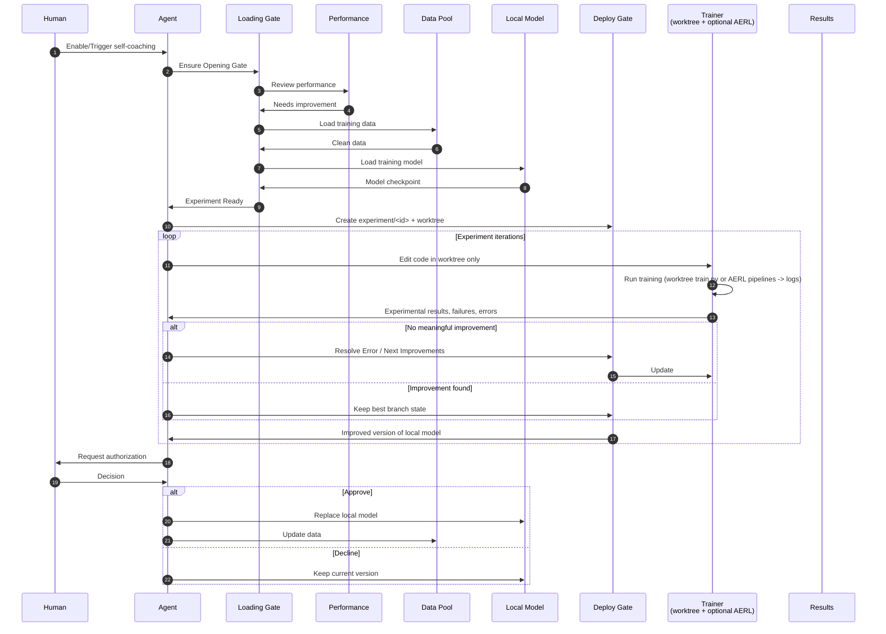

# self-coaching

A **portable, agent-agnostic skill set** for coaching any LLM or coding **agent** that can follow markdown skills and run Bash. Root `SKILL.md` is the full **orchestration** policy: a gated loop from observation through memory/skills/evals, self-play data, **Experience** logs, optional **AERL** SFT/GRPO-style training, and **user-authorized** merge or promotion. The same contract is the repo layout + `SKILL.md`; it is not tied to a single product.

This repository **decomposes** that policy into **atomic step skills** (separate folders with their own `SKILL.md`) so a host can load the umbrella policy or only the phase you are executing. See **`DESCRIPTION.md`** for the index of atomic skills, a concise list of **`scripts/`** helpers (including `mock-run-all.sh`), and how to run **`mock-services/`** (CLI, HTTP, and contract JSON) for deterministic dry runs without a real trainer.

**Install** the tree wherever your environment expects skills (project-local `skills/self-coaching`, a shared `tools/` tree, or a path your stack documents — see [Installation paths](#installation-paths)). Wire your **agent** to load root `SKILL.md` for the full loop, or load a subfolder skill when working in one phase only.

The default **target git tree** for the autoresearch-style trainer loop is an **external clone** of [karpathy/autoresearch](https://github.com/karpathy/autoresearch) (set `AUTORESEARCH_ROOT`; see [`upstream/README.md`](upstream/README.md)). The same worktree workflow applies to other ML repos you attach.

## Workflow

**How this maps in the default pack**

| Concept | Typical implementation |
|---------|-------------------------|
| **Loading Gate** | Dependencies, `prepare.py`, cache readiness, configured checkpoint paths (see `SKILL.md`). |
| **Performance** | Primary metric from `logs/<id>.log` (e.g. `val_bpb`) vs best; guardrails. |
| **Data Pool** | Training/val data (e.g. under `~/.cache/autoresearch/`) plus anything you curate — **including** dialogue-derived or **self-play** artifacts you point the pipeline at. |
| **Local Model** | Admin-chosen baseline: which checkpoint / which size variant (full vs smaller) before the run; see `SKILL.md` **Local Model configuration**. |
| **Deploy Gate** | Isolation (`experiment/<id>` + `worktrees/...`) and **human approval** before replacing the integrated line or promoted weights. |
| **Trainer** | Default: `uv run train.py` in the worktree (`scripts/run-once.sh`). Optional: **AERL** SFT/GRPO via `self-coaching-training/pipelines/` and `scripts/run-pipeline.sh` (HTTP or `PIPELINE_MODE=local` + `AERL_ROOT`; see `SKILL.md`). |
| **Trainer feedback** | Trainer returns experimental outcomes, failures, and errors to the agent; full raw run output still lands in `logs/<id>.log` (autoresearch or **AERL** run). |
| **Results** | Agent-resolved outcomes written to `experience/` (experiment log, errors, learnings); other durable artifacts per root `SKILL.md` (memory, skills, eval cases, curated data). |

The experiment loop runs autonomously inside the **Deploy Gate** boundary; **Replace local model** / **Update data** after approval are the only steps that change the canonical line the way your org defines it (merge, checkpoint swap, dataset refresh).

**Data Pool** includes data the agent gathered in prior user interactions and/or data produced in **self-play**, as long as your `prepare` / dataloader paths are wired to those sources.

**Local Model** is configured by admins (which checkpoint, main vs smaller model, device, etc.); the skill treats that configuration as fixed for a run unless policy says otherwise.

## What this skill set is for

- **Orchestrate** the agent on *how* to learn from tasks, generate stress data, evaluate, run training, and record outcomes — without flooding context with full `train` logs.
- **Focus the model** when training: architecture, `train.py` (or equivalent), metrics like `val_bpb` — i.e. the model the agent is training in that repo.
- **Experience** = durable logs under `experience/` (`EXPERIMENT_LOG.md`, `ERROR.md`, `LEARNINGS.md`).
- **Atomic skills** under `self-coaching-*` for phase-specific execution (see `DESCRIPTION.md`).

## Layout (current repository)

| Path | Role |
|------|------|
| `SKILL.md` | Full procedure: git, worktree, training redirect, merge gate, **Experience**, self-learning / self-play / eval / training playbooks. |
| `DESCRIPTION.md` | Short index of atomic skills and when to load each. |
| `docs/README.md` | Documentation index |
| `docs/guides/runbook.md` | Quick setup and day-to-day commands |
| `docs/guides/deploy-skill-pack.md` | **Active:** skill pack install and verification (T1) |
| `docs/guides/deploy-overview.md` | T1/T2/T3 deployment index |
| `docs/design/architecture.md` | Structure and control boundaries |
| `docs/design/pipeline.md` | Self-improving agent loop (eval → improve → deploy) |
| `docs/project/roadmap.md` | Deploy targets T1–T3 and milestones M0–M4 |
| `docs/project/progress.md` | Component status vs roadmap |
| `docs/project/integration-plan.md` | Production agent + AgentEvals adapter plan (T2/T3) |
| `SKILL_PACK_VERSION` | Skill pack release version (e.g. `0.2.0`) |
| `services/orchestrator/` | Optional pipeline orchestrator (T3) |
| `upstream/README.md` | How to clone autoresearch externally (`AUTORESEARCH_ROOT`) |
| `experience/` | **Experience** templates and optional `RUN_SUMMARY.json` |
| `self-coaching-self-learning/` | Phase skill: durable memory, skills, tests, eval cases from real experience |
| `self-coaching-self-play/` | Phase skill: generate and curate challenging tasks and trajectories |
| `self-coaching-evaluation/` | Phase skill: evaluation services and promotion gates |
| `self-coaching-training/` | Phase skill: SFT/RL training discipline; **`pipelines/`** (SFT/GRPO for **AERL**: `registry.yaml`, `_lib.sh`, per-pipeline `pipeline.yaml` + `run.sh`) and **`services/`** (`example.env`; copy to `.env`, gitignored) |
| `scripts/` | `preflight.sh`, `init-experience.sh` (bootstraps `experience/`, `logs/`, `worktrees/` under a chosen root), `run-once.sh`, `run-pipeline.sh`, `mock-run-all.sh` (deterministic mock end-to-end loop), hook helpers, `activator.sh` |
| `mock-services/` | Local mocks: `mock_self_coaching.py` (CLI `run-all`, HTTP `serve`), `plugin_mock.py`, and `contracts/mock_service_contract.json` — see **`DESCRIPTION.md`** |
| `logs/` / `worktrees/` | Created at runtime (often via `init-experience.sh`; see `.gitignore`) |
| `references/hooks-setup.md` | Hook wiring (optional; map events to your host) |

## Installation paths

Use **one** of these (or your own); only the path in hook commands and docs needs to be consistent.

| Where | Example |
|--------|---------|
| Project-local | `my-repo/skills/self-coaching/` (clone or copy this repo root) |
| User global | `~/skills/self-coaching/` or `~/.config/self-coaching/skill/` |
| Cursor (if you use it) | `~/.cursor/skills/self-coaching/` or `.cursor/skills/self-coaching/` |
| Other IDEs / agents | Follow that product's "skills" or "rules" directory; set hook `command` to **absolute** paths if relative paths are unreliable. |

Hooks in `references/hooks-setup.md` are **illustrative** (JSON + shell); adapt event names to your product.

## Quick start (T1 — skill pack)

1. Clone or copy this repository into your agent’s skill path (see [Installation paths](#installation-paths)).
2. **Install and verify:** `bash scripts/install-skill-pack.sh . --with-mock`
3. Read `DESCRIPTION.md`, then **`docs/guides/deploy-skill-pack.md`**, then `docs/guides/runbook.md`, then root `SKILL.md` (or start from **`docs/README.md`**).
4. Load a `self-coaching-*/SKILL.md` when executing only one phase.
5. Optional: hooks from `references/hooks-setup.md`; AERL from `self-coaching-training/services/example.env`.
6. Optional — HTTP mock service or orchestrator: **`docs/guides/deploy-overview.md`** (T2/T3; not required for T1).

For **AERL** pipelines, configure env from `self-coaching-training/services/example.env`, then from repo root either use `scripts/run-pipeline.sh` or invoke `self-coaching-training/pipelines/<id>/run.sh` with `LOG_FILE` set (see `docs/guides/runbook.md` and `SKILL.md`).

## Scope

- Training runs are automated within guardrails; **merge to the trainer repo `main`** and **external promotion** require explicit user approval.
