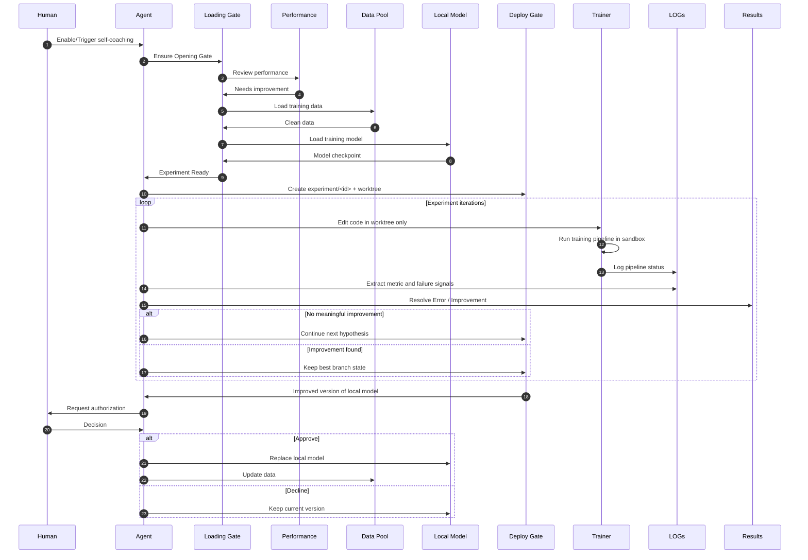

# Architecture

## Role

**Self-coaching** is a **portable, agent-agnostic skill package** (not tied to one IDE): the **policy** in `SKILL.md` and **Experience** on disk are the contract. A **coached agent** evolves a **model** in a **git** repo by passing a **Loading Gate** (readiness), using a **Data Pool** and **Local Model** as configured, running an experiment loop behind a **Deploy Gate** (worktree + approval), and writing **Results** to `experience/` while full train output goes to `logs/`.

The canonical end-to-end sequence is the same as the Mermaid block in `README.md` (Loading Gate, Performance, Data Pool, Local Model, Deploy Gate, Trainer, LOGs, Results).

## Control boundaries

- **Upstream integration line:** `upstream/autoresearch` on `main`
- **Experiment line:** `worktrees/<experiment_id>` with branch `experiment/<id>`
- **Execution logs:** `logs/<id>.log` (full stdout/stderr redirected)
- **Experience logs:** `experience/*.md` (+ optional `experience/RUN_SUMMARY.json`)

## Components

1. **Policy** — `SKILL.md` (worktree workflow, when to train/stop, merge gate, **Experience** paths).
2. **Target repo** — default: `upstream/autoresearch/` (vendored [karpathy/autoresearch](https://github.com/karpathy/autoresearch)); `main` is the integration line.
3. **Experiment line** — `worktrees/<id>/` (git worktree + branch). All experiment edits go here during the loop.
4. **Execution logs** — `logs/<id>.log` (full `train` stdout/stderr; parse with `Read` in small chunks).
5. **Experience** (persistent) — `experience/EXPERIMENT_LOG.md` (outcomes), `experience/ERROR.md` (failures), `experience/LEARNINGS.md` (model/training insight). Optional: `experience/RUN_SUMMARY.json`.
6. **Hooks** — `scripts/hook-*.sh` + `references/hooks-setup.md`.

## Data flow

Use the **sequence diagram in `README.md`** as the single source of truth. It names: **Human, Agent, Loading Gate, Performance, Data Pool, Local Model, Deploy Gate, Trainer, LOGs, Results**.

Below is the same diagram (keep in sync with `README.md` when you change the pipeline).

## Conceptual ↔ concrete mapping

| Concept | Meaning | Default pack |
|---------|---------|----------------|
| Loading Gate | Preconditions to train (deps, data/cache, checkpoints). | `uv sync`, `prepare.py`, checkpoint paths declared for the run. |
| Performance | Whether the metric improved vs baseline / best. | Parse `logs/<id>.log`; compare `metric_name`; guardrails in `SKILL.md`. |
| Data Pool | All training/val sources you allow: shipped data, caches, **user-dialogue-derived** corpora, **self-play** outputs. | Typically `~/.cache/autoresearch/` + any paths your `prepare`/loader uses. |
| Local Model | Admin-selected starting point (full vs smaller, which checkpoint). | Env / config / checkpoint path before `uv run train.py`; not mutated on `main` until merge approval. |
| Deploy Gate | Experiment isolation + promotion policy. | Branch `experiment/<id>`, path `worktrees/<id>/`; merge or checkpoint swap only after human decision. |
| LOGs | Raw train process output. | `logs/<id>.log` |
| Results | Structured outcomes + errors + learnings. | `experience/EXPERIMENT_LOG.md`, `experience/ERROR.md`, `experience/LEARNINGS.md` |

## Merge gate

- The agent may run experiment iterations autonomously inside the **Deploy Gate** (worktree only).
- The agent may not **Replace local model** or **Update data** on the canonical integration path without explicit **Human** authorization (same gate as merging `experiment/<id>` into `upstream/autoresearch` `main`, or swapping promoted weights).
- External deployment remains gated separately if your org requires it.

## Optional reference

- `references/superpowers-skills/` — not required at runtime.
