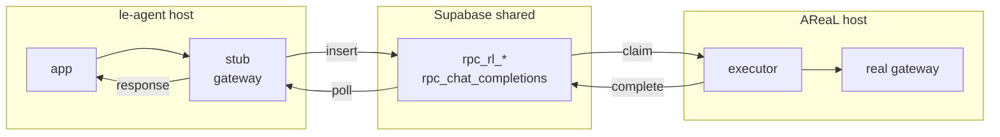
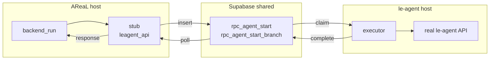
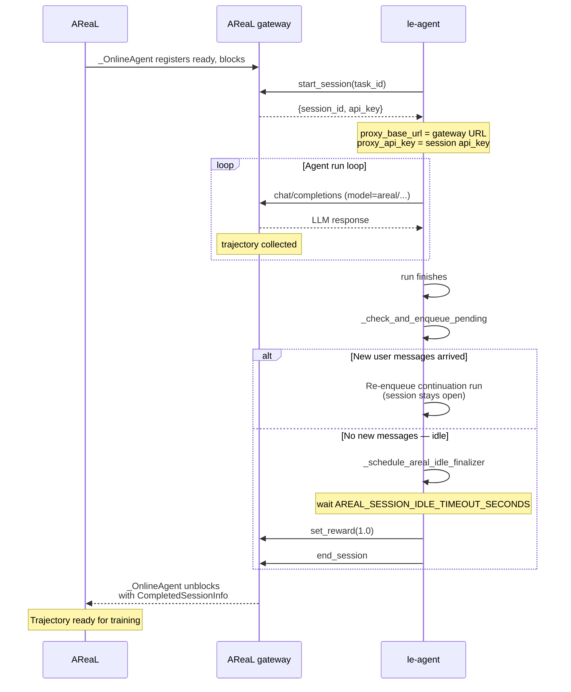
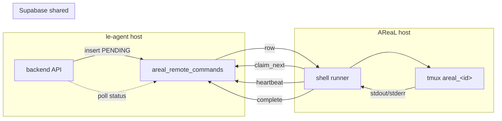
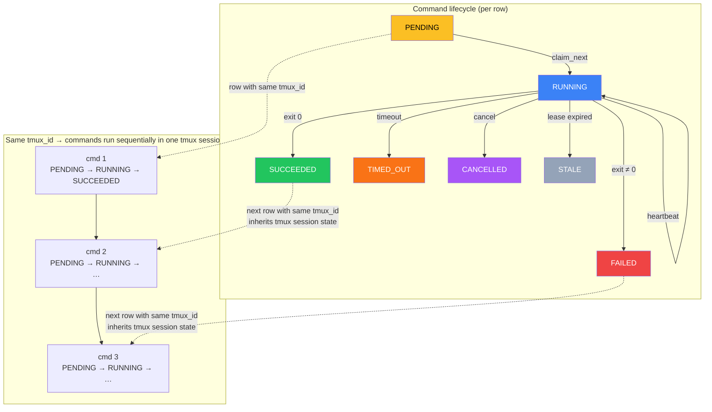

# db_bridge — Supabase-as-springboard RPC bridge

Relays all cross-service HTTP calls between **le-agent** and **AReaL** through
per-endpoint Supabase tables, so the two services can run on hosts that cannot
reach each other but share one Supabase database.

It is a transparent drop-in when the matching stub and executor processes are
scoped with the same `BRIDGE_USER_ID`: point the existing service URLs at local
stub servers and run the matching executor on the other host. If one stub serves
multiple users, the caller must send `X-Bridge-User-Id` with each bridged
request instead.

## How it works

Each cross-service call is a **channel** backed by one Supabase table. For every
channel there are two bridge components:

- **Stub server** — a localhost HTTP server that mirrors the *remote* API the
  local app calls. It captures the request (method, path, headers, raw body),
  enqueues a row, polls that row for the response, and returns it. Transparent.
- **Executor worker** — polls the table, atomically claims a pending row
  (`FOR UPDATE SKIP LOCKED`), forwards it to the *real* local service over
  loopback, and writes the response back.

**Gateway channels** — `rl_start_session`, `rl_set_reward`, `rl_end_session`, `chat_completions`



**Leagent API channels** — `agent_start`, `agent_start_branch`



### Online training pipeline

When AReaL runs in **online mode**, le-agent and AReaL cooperate through the
bridge to collect RL trajectories. Each training sample follows this lifecycle:

1. **AReaL** `_OnlineAgent` registers as "ready" on the proxy gateway, then
   blocks waiting for an external session.
2. **le-agent** calls `start_session` → gets back `session_id` + `api_key`.
   The `api_key` / gateway URL become the agent's `proxy_base_url` and
   `proxy_api_key`, routing all LLM calls through AReaL's proxy gateway.
3. The agent runs, making `/chat/completions` calls through the bridge (model
   names starting with `areal/`). AReaL collects the trajectory for training.
4. When the agent finishes a run, `_check_and_enqueue_pending` checks for new
   user messages that arrived during execution:
   - **New messages found** → re-enqueue a continuation run (same session, no
     `end_session` yet).
   - **No new messages** → schedule `_schedule_areal_idle_finalizer`, which
     fires after `AREAL_SESSION_IDLE_TIMEOUT_SECONDS` if no run is active.
5. The finalizer calls `set_reward` (constant `1.0`) then `end_session`,
   signalling AReaL that the trajectory is complete and ready for training.
6. `_OnlineAgent` unblocks, returning `CompletedSessionInfo` with the
   trajectory for AReaL's training loop.



| Channel              | Path                      | Group         | Stub host | Executor host |
|----------------------|---------------------------|---------------|-----------|---------------|
| `rl_start_session`   | `/rl/start_session`       | `gateway`     | le-agent  | AReaL         |
| `rl_set_reward`      | `/rl/set_reward`          | `gateway`     | le-agent  | AReaL         |
| `rl_end_session`     | `/rl/end_session`         | `gateway`     | le-agent  | AReaL         |
| `chat_completions`   | `/chat/completions`       | `gateway`     | le-agent  | AReaL         |
| `agent_start`        | `/api/agent/start`        | `leagent_api` | AReaL     | le-agent      |
| `agent_start_branch` | `/api/agent/start-branch` | `leagent_api` | AReaL     | le-agent      |

The le-agent SSE stream (`/api/tasks/{id}/stream`) is intentionally **not**
bridged: AReaL's `_wait_for_agent_run` already falls back to polling the shared
`agent_runs` / `tasks` tables directly.

## Setup

Copy this `db_bridge/` directory to **both** hosts, then install dependencies:

```bash
cd db_bridge
uv sync                # create .venv and install dependencies
```

For optional header encryption at rest, include the crypto extra:

```bash
uv sync --extra crypto  # installs the 'cryptography' package
```

Apply the schema once against the shared database (it is idempotent):

```bash
psql "$DATABASE_URL" -f db_bridge/schema.sql
# or paste schema.sql into the Supabase SQL editor
```

Existing installs that already contain bridge rows may get `user_id` added as a
nullable column first. Drain, delete, or backfill old rows, then re-apply
`schema.sql` to enforce `user_id not null` on empty/backfilled tables.

## Deployment — four processes total

Run two processes per host — one stub, one executor. **All commands must use
`uv run`** so Python resolves the package and its virtual environment correctly;
bare `python -m db_bridge.*` will fail with `ModuleNotFoundError`.

**le-agent host**
```bash
cd db_bridge && set -a && source .env.leagent && set +a
pids=()
cleanup() {
  trap - INT TERM EXIT
  kill "${pids[@]}" 2>/dev/null || true
  wait "${pids[@]}" 2>/dev/null || true
}
trap cleanup INT TERM EXIT

uv run python -m db_bridge.run_stub     --side leagent & pids+=("$!")
uv run python -m db_bridge.run_executor --side leagent & pids+=("$!")

wait -n "${pids[@]}"
status=$?
cleanup
exit "$status"
```

**AReaL host**
```bash
cd db_bridge && set -a && source .env.areal && set +a
pids=()
cleanup() {
  trap - INT TERM EXIT
  kill "${pids[@]}" 2>/dev/null || true
  wait "${pids[@]}" 2>/dev/null || true
}
trap cleanup INT TERM EXIT

uv run python -m db_bridge.run_stub     --side areal & pids+=("$!")     # serves /api/agent/* on 127.0.0.1:9101
uv run python -m db_bridge.run_executor --side areal & pids+=("$!")     # forwards /rl/*, /chat/completions to the real gateway

wait -n "${pids[@]}"
status=$?
cleanup
exit "$status"
```

Stub servers bind to `127.0.0.1` only; the local application is the sole caller.

### Running with tmux

Use tmux when you want the bridge to keep running after your SSH session
disconnects. Run the matching command on each host from the directory that
contains `db_bridge/`. These commands start one tmux session with separate
`stub` and `executor` windows.

**le-agent host**
```bash
tmux new-session -d -s db_bridge_leagent -n stub \
  'cd db_bridge && set -a && source .env.leagent && set +a && uv run python -m db_bridge.run_stub --side leagent'

tmux new-window -t db_bridge_leagent -n executor \
  'cd db_bridge && set -a && source .env.leagent && set +a && uv run python -m db_bridge.run_executor --side leagent'

tmux attach -t db_bridge_leagent
```

**AReaL host**
```bash
tmux new-session -d -s db_bridge_areal -n stub \
  'cd db_bridge && set -a && source .env.areal && set +a && uv run python -m db_bridge.run_stub --side areal'

tmux new-window -t db_bridge_areal -n executor \
  'cd db_bridge && set -a && source .env.areal && set +a && uv run python -m db_bridge.run_executor --side areal'

tmux attach -t db_bridge_areal
```

Common tmux operations:

```bash
tmux ls                                      # list bridge sessions
tmux attach -t db_bridge_leagent             # inspect le-agent bridge
tmux attach -t db_bridge_areal               # inspect AReaL bridge
tmux kill-session -t db_bridge_leagent       # stop le-agent bridge
tmux kill-session -t db_bridge_areal         # stop AReaL bridge
```

This is only process supervision for the existing bridge stub/executor. It does
not add a database channel that executes arbitrary shell commands.

## Transparent integration (config-only)

For a per-user bridge deployment, no application code changes are needed: set
the same `BRIDGE_USER_ID` on the stub and executor processes that handle that
user's traffic, then point existing URLs at the local stubs. If a single stub
process serves multiple users, callers must include
`X-Bridge-User-Id: <user-uuid>` on bridged requests. See `.env.leagent.example`
and `.env.areal.example`.

**le-agent app** (`api.py` / workers):
```bash
AREAL_ONLINE_TRAINING_ENABLED=true
AREAL_PROXY_GATEWAY_URL=http://127.0.0.1:9100
```
`AREAL_PROXY_GATEWAY_URL` is returned by `areal_online.gateway_url()` and is also
handed to the agent as the LLM `proxy_base_url` (`agent_loop.py` passes it as the
OpenAI `api_base`), so `/rl/*` and AReaL `/chat/completions` route through the
gateway stub automatically.

The gateway stub only enqueues `/chat/completions` requests whose JSON `model`
starts with `areal/`, for example `areal/qwen/qwen3_5-9b`. Other models bypass
the Supabase queue and are forwarded directly to the received request URL.

**AReaL** (`customized_areal/tpfc/backend_run.py`):
```bash
LE_AGENT_API_URL=http://127.0.0.1:9101
```
`backend_run` POSTs `/api/agent/start` and `/api/agent/start-branch` there, and
reads run status from the shared `agent_runs` / `tasks` tables (covering the
dropped SSE stream).

## Configuration (environment variables)

| Variable | Default | Purpose |
|----------|---------|---------|
| `SUPABASE_URL` | — (required) | Shared Supabase project URL |
| `SUPABASE_SERVICE_ROLE_KEY` | — (required) | Service-role key (RLS bypass) |
| `BRIDGE_POLL_INTERVAL` | `0.075` | Poll interval in seconds (~50–100 ms) |
| `BRIDGE_STALE_SECONDS` | `300` | Reclaim rows stuck in `claimed` past this |
| `BRIDGE_USER_ID` | — | Optional default user UUID for this bridge process; if unset, stub callers must send `X-Bridge-User-Id` |
| `BRIDGE_CODEC_THRESHOLD` | `2048` | Bytes above which bodies are gzip+base64'd |
| `BRIDGE_MAX_BODY_BYTES` | `67108864` | Reject (413) bodies larger than this |
| `BRIDGE_STUB_HOST` | `127.0.0.1` | Stub bind address |
| `BRIDGE_GATEWAY_STUB_PORT` | `9100` | Port for the gateway stub (le-agent side) |
| `BRIDGE_LEAGENT_STUB_PORT` | `9101` | Port for the le-agent-API stub (AReaL side) |
| `BRIDGE_GATEWAY_UPSTREAM_URL` | `http://127.0.0.1:8080` | Real AReaL gateway (AReaL executor) |
| `BRIDGE_LEAGENT_UPSTREAM_URL` | `http://127.0.0.1:8000` | Real le-agent API (le-agent executor) |
| `BRIDGE_TIMEOUT_<CHANNEL>` | per-channel | Override stub wait timeout (e.g. `BRIDGE_TIMEOUT_CHAT_COMPLETIONS=180`) |
| `BRIDGE_CONCURRENCY_<CHANNEL>` | per-channel | Override executor worker count |
| `BRIDGE_REDACT_TOKENS_AFTER_COMPLETE` | `false` | Redact `Authorization` from rows after completion |
| `BRIDGE_HEADER_ENCRYPTION_KEY` | — | Optional Fernet key to encrypt captured tokens at rest |
| `BRIDGE_STATS_INTERVAL` | `0` | Seconds between metrics/queue-depth log lines (`0` disables) |
| `BRIDGE_CLEANUP_INTERVAL` | `300` | Seconds between executor cleanup passes (`0` disables) |
| `BRIDGE_ROW_RETENTION_SECONDS` | `86400` | Keep terminal bridge rows for this many seconds |
| `BRIDGE_CLEANUP_BATCH_LIMIT` | `1000` | Maximum rows deleted per channel per cleanup pass |

## Observability

By default, processes log only request/response events: stub enqueue, direct
chat forwarding, returned responses, timeouts, and relay errors; executor
forward failures and completed upstream responses. Idle DB polling does not
produce logs.

Set `BRIDGE_STATS_INTERVAL` to a positive number to opt into periodic
per-channel metrics/queue-depth logs. Stub side reports `enqueued / inflight /
done / errors / timeouts`, payload sizes, and average end-to-end latency;
executor side reports `forwarded / forward_errors`, average forward latency,
and live `queue_depth` (pending row counts). Oversized requests are rejected
with 413 before enqueue; relay timeouts return 504; executor transport failures
return 502.

A `/healthz` endpoint on each stub server returns `{"status": "ok", "side":
"<side>", "channels": [...]}`.

## User isolation

Every queued bridge row stores `user_id`, and every bridge table has a
`(user_id, status, created_at)` index so polling and claiming can stay scoped
and fast. The bridge never derives this value from JWT `Authorization` tokens.
Choose one explicit source:

- Set `BRIDGE_USER_ID=<user-uuid>` when a stub/executor pair is dedicated to
  one user. Use the same value on both sides of that pair. Executors with this
  setting only claim rows for that user.
- Send `X-Bridge-User-Id: <user-uuid>` on each bridged request when one stub
  process serves multiple users. The stub stores this value on the row, then
  strips the header before forwarding to the real upstream service.

If neither source is present, the stub returns `400` and does not enqueue a row.

## Security hardening

- **Token encryption at rest** — set `BRIDGE_HEADER_ENCRYPTION_KEY` (a
  `Fernet.generate_key()` value, identical on both hosts) to encrypt the
  `Authorization` header before it is stored; the executor decrypts it only in
  memory just before replaying upstream. Requires the optional `cryptography`
  package (`uv sync --extra crypto`); if a key is set but the package is
  missing, the process fails fast.
- **Post-completion redaction** — set `BRIDGE_REDACT_TOKENS_AFTER_COMPLETE=true`
  to scrub the stored `Authorization` value (to `REDACTED`) after the response
  has been relayed, keeping audit rows free of live tokens.
- **Payload limits** — bodies above `BRIDGE_MAX_BODY_BYTES` are rejected. On
  self-hosted Supabase, also raise the PostgREST/proxy request-body limit
  (Kong/nginx) so large chat payloads and base64 files are not truncated; gzip
  compression (automatic above `BRIDGE_CODEC_THRESHOLD`) keeps most payloads
  small.

## Retention / cleanup

Executors periodically delete old terminal rows (`done` / `error`) in bounded
batches. Active `pending` / `claimed` rows are never deleted by cleanup because
they may still be claimed or reclaimed. Defaults keep terminal rows for one day
and delete up to 1000 old rows per channel every 300 seconds.

Set `BRIDGE_CLEANUP_INTERVAL=0` to disable automatic cleanup, or raise
`BRIDGE_ROW_RETENTION_SECONDS` if you need a longer audit window. Cleanup is
not user-scoped; it only deletes terminal rows older than the retention window.

## Crash recovery

There is no separate reaper process. `bridge_claim_next` reclaims any row left
in `claimed` longer than `BRIDGE_STALE_SECONDS`, so if an executor dies
mid-request another worker picks the row up after the stale window.

## Tests

```bash
cd db_bridge
uv run python -m pytest -q                                                   # unit + in-memory integration (no DB needed)
BRIDGE_TEST_PG_DSN=postgresql://... uv run python -m pytest -q               # also runs live-DB schema tests
```


> **📌 Reminder — AReaL remote shell runner.** This section documents the
> optional `run_shell_runner` process that executes arbitrary shell text on the
> AReaL host via the shared database. It is gated behind
> `AREAL_REMOTE_SHELL_ENABLED=true` and should only be enabled on trusted hosts.
> Keep this section up to date when the runner's schema, config, or lifecycle
> changes.

## AReaL remote shell runner (trusted-host, feature-flagged)

A separate, optional process executes arbitrary shell text on the AReaL host on
behalf of authenticated le-agent users and agents, using the shared database as
the command transport. It exists for the case where the two machines cannot
reach each other over SSH but share one Supabase database.

> **Trust boundary.** This is **not** a sandbox. A runner with the flag enabled
> runs arbitrary host shell code for any caller authorized to enqueue commands.
> `tmux` is used only for lifecycle management (named sessions, log capture,
> termination), not isolation. Enable it only where the AReaL host is
> intentionally trusted for those callers.

### How it works





1. The le-agent backend (the user-facing, user-access-checked service) inserts
   rows into `areal_remote_commands` with status `PENDING`, a `user_id`, and a
   caller-chosen `tmux_id`.
2. The runner on the AReaL host claims a row (`areal_shell_claim_next`), creates
   or reuses the tmux session `areal_<tmux_id>`, and runs the command. Commands
   with the same `tmux_id` are claimed one at a time so they target the same
   remote terminal sequentially.
3. While running, it heartbeats (`areal_shell_heartbeat`) to refresh its lease
   and persist bounded `stdout_tail` / `stderr_tail` / `log_bytes`, observing
   any backend cancellation.
4. On exit it writes a terminal status (`SUCCEEDED` / `FAILED`), the exit code,
   and final logs (`areal_shell_complete`). Timeouts → `TIMED_OUT`, cancellation
   → `CANCELLED`. A periodic sweep marks ambiguous expired-lease running rows
   `STALE` rather than re-executing them.

The runner uses `SUPABASE_SERVICE_ROLE_KEY` because it claims/updates rows
across users. Logs may contain secrets (commands are arbitrary); product
surfaces must treat them as user-private data.

### Running it (AReaL host)

Apply `schema.sql` (idempotent) so the `areal_remote_commands` table and
`areal_shell_*` functions exist, then:

```bash
cd db_bridge && set -a && source .env.areal && set +a
AREAL_REMOTE_SHELL_ENABLED=true uv run python -m db_bridge.run_shell_runner
```

`tmux` must be installed on the host. With the flag unset/false the runner
starts but refuses to claim any command, so an accidental deploy never executes
host shell code.

### Configuration

| Variable | Default | Purpose |
|----------|---------|---------|
| `AREAL_REMOTE_SHELL_ENABLED` | `false` | Master switch; runner refuses to claim when false |
| `AREAL_REMOTE_SHELL_RUNNER_ID` | random | Stable runner identity for leases |
| `AREAL_REMOTE_SHELL_POLL_INTERVAL` | `1.0` | Seconds between claim/monitor polls |
| `AREAL_REMOTE_SHELL_LEASE_SECONDS` | `60` | Lease duration; must exceed the poll interval |
| `AREAL_REMOTE_SHELL_SWEEP_INTERVAL` | `30` | Seconds between stale-row sweeps |
| `AREAL_REMOTE_SHELL_DEFAULT_TIMEOUT` | `300` | Default per-command timeout (seconds) |
| `AREAL_REMOTE_SHELL_MAX_TIMEOUT` | `3600` | Upper bound a command timeout is clamped to |
| `AREAL_REMOTE_SHELL_MAX_LOG_BYTES` | `65536` | Bounded tail captured per stream |
| `AREAL_REMOTE_SHELL_MAX_CONCURRENCY` | `4` | Max commands executed in parallel |
| `AREAL_REMOTE_SHELL_DEFAULT_CWD` | — | Working directory when a command omits one |
| `AREAL_REMOTE_SHELL_SESSION_PREFIX` | `areal_` | tmux session name prefix |
| `AREAL_REMOTE_SHELL_WORK_DIR` | `/tmp/areal_remote_shell` | Runner scratch dir for capture files |
| `AREAL_REMOTE_SHELL_TMUX_BIN` | `tmux` | tmux binary path |
| `AREAL_REMOTE_SHELL_CLEANUP_INTERVAL` | `300` | Seconds between terminal-row cleanup passes (`0` disables) |
| `AREAL_REMOTE_SHELL_RETENTION_SECONDS` | `604800` | Keep terminal command rows this long |

Example enqueue shape:

```sql
insert into public.areal_remote_commands (
  user_id,
  tmux_id,
  command,
  cwd,
  timeout_seconds
)
values (
  '<user_uuid>',
  'debug-gpu',
  'nvidia-smi',
  '/tmp',
  120
);
```

Use the same `tmux_id` for follow-up commands that should reuse the same remote
tmux terminal. Use a different `tmux_id` for independent terminals. The runner
no longer requires or reads `task_id` or `account_id` for remote shell commands.

> The le-agent backend command-creation / inspection / cancellation API (with
> feature-flag gating and user authorization) is the companion slice and lives
> in the le-agent backend, not in `db_bridge`.
